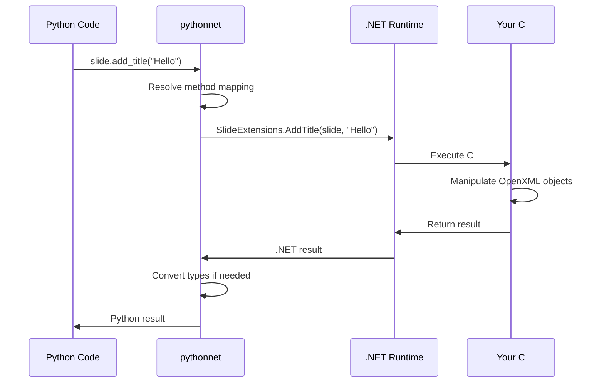

# Python ↔ C# Interop Architecture

## Process Memory Layout

```
┌─────────────────────────────────────────────────────────────┐
│                    Single Process Space                     │
├─────────────────────────────┬───────────────────────────────┤
│        Python Runtime      │        .NET Runtime           │
├─────────────────────────────┼───────────────────────────────┤
│  Python Interpreter (CPython) │   CoreCLR (.NET Runtime)   │
│  - Python objects          │   - .NET objects              │
│  - Python GC               │   - .NET GC                   │
│  - Python modules          │   - .NET assemblies           │
├─────────────────────────────┼───────────────────────────────┤
│                    pythonnet Bridge                         │
│              - Type marshalling                             │
│              - Method dispatch                              │
│              - Exception translation                        │
└─────────────────────────────────────────────────────────────┘
```

## Method Call Flow



## Detailed Call Mechanism

### 1. Assembly Loading
```python
import clr  # Python imports pythonnet
clr.AddReference("path/to/your.dll")  # Loads C# assembly into .NET runtime
```

**What happens internally:**
- pythonnet uses .NET's `Assembly.LoadFrom()` 
- Assembly metadata is read (classes, methods, types)
- Type information cached for fast access
- No code execution yet - just loading definitions

### 2. Type Import
```python
from OpenXMLExtensions import SlideExtensions  # Import C# static class
from DocumentFormat.OpenXml.Presentation import Slide  # Import OpenXML types
```

**What happens internally:**
- pythonnet creates Python proxy objects
- Proxy objects wrap .NET type metadata
- Python's import system maps to .NET namespaces
- Method signatures are introspected and cached

### 3. Object Creation
```python
# Python creates .NET object through proxy
slide = Slide(...)  # Calls .NET constructor
```

**Memory layout:**
```
Python Process Memory:
├── Python object (proxy) ──────┐
│   - Contains .NET object ref   │
│   - Python methods wrapper     │
└─────────────────────────────────┘
                                 │
                                 ▼
├── .NET Heap ─────────────────────
│   ├── Actual Slide object     
│   ├── OpenXML DOM nodes       
│   └── Other .NET objects      
└─────────────────────────────────
```

### 4. Method Invocation
```python
SlideExtensions.AddTitle(slide, "My Title")
```

**Step-by-step execution:**
1. **Python call intercepted** by pythonnet proxy
2. **Method resolution**: Find `AddTitle` in `SlideExtensions`
3. **Argument marshalling**: Convert Python `str` → .NET `string`
4. **CLR method dispatch**: Call actual C# method
5. **C# execution**: Your extension method runs
6. **Return value marshalling**: Convert result back to Python
7. **Exception handling**: .NET exceptions → Python exceptions

## Type System Integration

### Automatic Type Conversion
```python
# Python types automatically convert to .NET types
python_string = "Hello"          # str
python_int = 42                  # int  
python_float = 3.14             # float
python_bool = True              # bool

# When calling C# method:
SlideExtensions.AddTitle(slide, python_string)  # str → System.String
shapeTree.AddRectangle(1, 2, 3, 4)             # int → System.Int32
```

### Complex Type Handling
```python
# .NET objects stay in .NET heap, Python holds references
presentation_doc = PresentationDocument.Create("file.pptx", DocumentType.Presentation)
slide = presentation_doc.GetSlide(1)  # Returns .NET Slide object
shapes = slide.CommonSlideData.ShapeTree.Elements()  # .NET IEnumerable

# Python can iterate over .NET collections
for shape in shapes:  # pythonnet handles iteration protocol
    shape_name = shape.GetName()  # Direct call to C# method
```

## Memory Management

### Garbage Collection Coordination
```
┌─────────────────┐    ┌─────────────────┐
│   Python GC     │    │    .NET GC      │
│                 │    │                 │
│  Python objects │    │  .NET objects   │
│  with .NET refs │◄──►│  referenced by  │
│                 │    │  Python proxies │
└─────────────────┘    └─────────────────┘
```

**Key points:**
- Python proxy objects keep .NET objects alive
- .NET GC can't collect objects referenced by Python
- Python GC releases .NET references when proxy is deleted
- Both GCs coordinate to prevent memory leaks

### Resource Management
```python
# IDisposable objects work with Python context managers
with PresentationDocument.Create("file.pptx", DocumentType.Presentation) as doc:
    # Use document
    slide = doc.AddSlide()
    SlideExtensions.AddTitle(slide, "Title")
    doc.Save()
# doc.Dispose() called automatically
```

## Performance Characteristics

### Method Call Overhead
```
Direct C# call:           ~1ns
Python → C# via pythonnet: ~100ns  (100x slower)
Python → REST API:        ~1ms     (1,000,000x slower)
```

### Bulk Operations Optimization
```python
# ❌ Inefficient - many Python→C# calls
for i in range(1000):
    SlideExtensions.AddTextbox(slide, f"Text {i}")

# ✅ Efficient - batch operations in C#
text_items = [f"Text {i}" for i in range(1000)]
# Implement bulk method in C# for better performance
SlideExtensions.AddMultipleTextboxes(slide, text_items)
```

## Error Handling

### Exception Translation
```python
try:
    SlideExtensions.AddTitle(None, "Title")  # Pass null slide
except System.ArgumentNullException as e:   # .NET exception type
    print(f"C# threw ArgumentNullException: {e}")
    
# Stack trace shows both Python and C# calls:
# Traceback (most recent call last):
#   File "test.py", line 2, in <module>
#     SlideExtensions.AddTitle(None, "Title")
#   System.ArgumentNullException: Value cannot be null.
#   at OpenXMLExtensions.SlideExtensions.AddTitle(Slide slide, String text)
```

## Why This Works So Well

### 1. **Same Process Space**
- No serialization/deserialization overhead
- Direct memory access
- Shared object references

### 2. **Lazy Loading**
- Assemblies loaded only when needed
- Method resolution cached
- Type metadata cached

### 3. **Bi-directional Integration**
- Python can call C# methods
- C# can call back to Python (callbacks)
- Event handling works seamlessly

### 4. **Rich Type System**
- Generics support: `List<T>`, `Dictionary<K,V>`
- LINQ expressions work from Python
- Extension methods work naturally

## Real-World Example

Here's what actually happens when you run this Python code:

```python
from doclayer_python import SlideBuilder

builder = SlideBuilder()  # Creates Python wrapper
with builder.create_presentation("test.pptx") as pres:  # Opens .NET PresentationDocument
    pres.set_widescreen()  # Calls .NET SetSlideSizeWidescreen()
    slide = pres.add_slide()  # Creates .NET Slide object
    slide.add_title("Hello")  # Calls SlideExtensions.AddTitle()
```

**Under the hood:**
1. Python imports trigger .NET assembly loading
2. Context manager calls .NET PresentationDocument.Create()
3. Each method call marshals through pythonnet bridge
4. Your C# OpenXML extension methods execute normally
5. .NET objects live in .NET heap, controlled by Python references
6. Context manager ensures proper .NET resource cleanup

This gives you **native .NET performance** with **Python's ease of use** - perfect for AI frameworks that need both speed and simplicity!